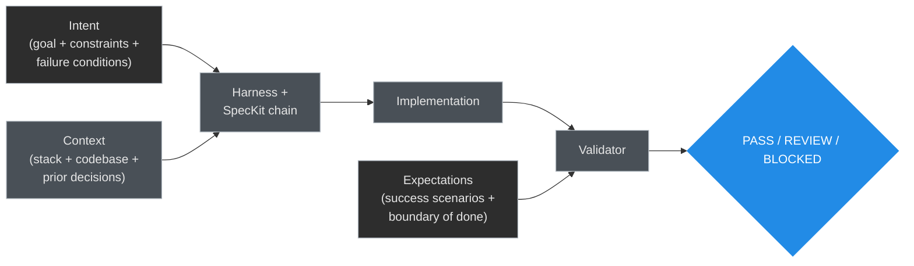
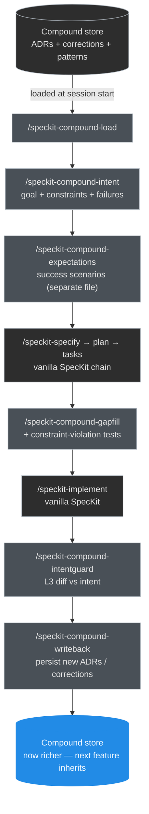
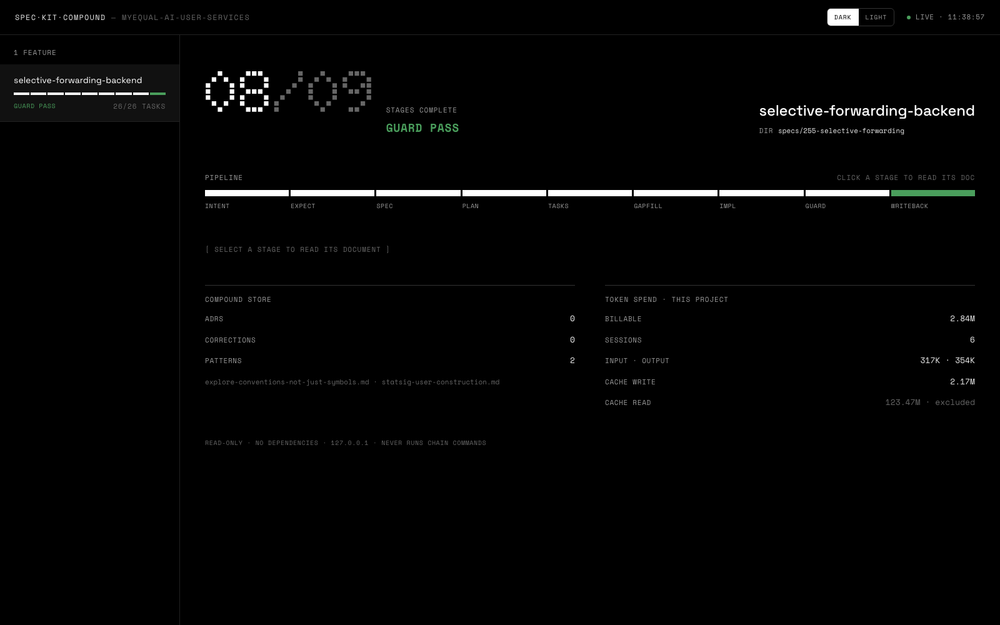
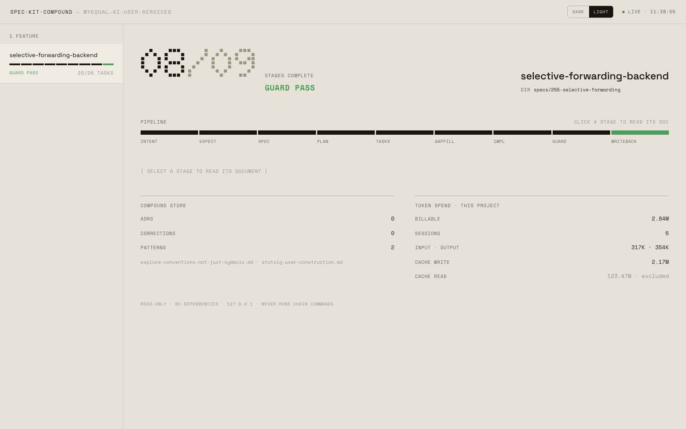
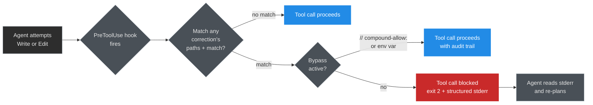

# spec-kit-compound

[](https://github.com/aldefy/spec-kit-compound/releases/tag/v0.3.1)
[](LICENSE)
[](https://github.com/github/spec-kit)
[](#project-status)

A SpecKit extension that adds **intent-driven scoping** (ICE), **compound engineering memory**, and **L3 intent guard validation** to the Spec-Driven Development workflow.

> **Positioning.** This is an *extension*, not a *harness*. We sit on top of whatever harness SpecKit drives (Claude Code, Cursor, Copilot, Gemini CLI, etc.) and inject the missing intent / expectations / compound discipline before, during, and after the standard SpecKit chain. We are not a competitor to harness frameworks like Garura — we complement them.

**Contents:** [Why this exists](#why-this-exists) · [Concepts](#the-concepts) · [What you get](#what-you-get) · [Install](#install) · [Chain at a glance](#the-chain-at-a-glance) · [Two-layer enforcement](#two-layer-enforcement) · [Roadmap](#roadmap) · [Project status](#project-status)

---

## Why this exists

SpecKit is excellent at generating specs and driving the agentic implementation loop, but it leaves four systematic gaps. spec-kit-compound closes each.

| Gap in vanilla SpecKit | How spec-kit-compound closes it |
|---|---|
| **Intent ≠ spec.** `/speckit-specify`'s template tells the agent to *"make informed guesses"* and *"fill gaps"*, capped at *"Maximum 3 [NEEDS CLARIFICATION] markers."* Spec ambiguity becomes unsupervised model choices. | `/speckit-compound-intent` runs an **interview** that refuses to terminate until the intent passes a strict quality rubric (G1–G5 for goal, C1–C5 for constraints, F1–F4 for failure conditions). No silent gap-filling. |
| **Expectations live in the same artifact as intent.** Success scenarios appear in the file the builder reads, which enables **reward-hacking** — the builder optimizes for the validator's checks. | `/speckit-compound-expectations` writes success scenarios to a **separate file** the builder doesn't read. Soft compartmentation. The validator (`/speckit-compound-intentguard`) reads it; the builder (`/speckit-implement`) doesn't. |
| **Memory lives locally.** Claude Code's memory files don't go in version control. New sessions, new machines, new teammates start with zero context. | `/speckit-compound-load` and `writeback` make the agent's memory a **committed, version-controlled** artifact under `docs/compound/` — ADRs + corrections + patterns, persisted across sessions. |
| **Even when memory is persisted, it's passive.** ADR-style notes load as context but the agent can ignore them. The same mistakes get repeated. | **v0.3+ `PreToolUse` hook** turns the compound store into **active enforcement**. Write/Edit attempts that match documented past mistakes get blocked *before* the code is written. Two bypass mechanisms keep it overridable. |

---

## The concepts

Two ideas this extension wires together. Neither is mine — both came from people doing real work and writing it up.

### Compound engineering

Coined by [Every](https://every.to/guides/compound-engineering) (Kevin Rose, Dan Shipper).

> Every engineering cycle should make the next one easier.

You do this by writing durable notes back into the repo as you work — architectural decisions, AI corrections, reusable patterns — and loading them as context before the next cycle.

The **compound store** (committed under `docs/compound/`) holds three things:

| Slot | Purpose |
|---|---|
| **ADRs** | Architectural decisions — *do not re-debate* |
| **Corrections** | Past AI mistakes and the rules derived from them — *do not repeat* |
| **Patterns** | Proven approaches for this codebase — *reach for these by default* |

After 20 features the compound store has more applied wisdom than any constitution doc you could write up front — because it was derived from real work, not imagined ahead of time. SpecKit's `/speckit-constitution` is a one-time static document; the compound store is **living, growing**. That's the "compound" in compound engineering.

### ICE — Intent, Context, Expectations

Coined by Kapil Viren Ahuja (Activated Thinker on Medium) as the building blocks of **intent-driven software development** (IDSD). The frame splits what you give an agent into three slots:



| Slot | What it is | Who owns it |
|---|---|---|
| **Intent** | Goal + constraints + failure conditions — what only you can write | You |
| **Context** | The surround (stack, codebase, prior decisions) — fed progressively | The harness |
| **Expectations** | Success scenarios + boundary of done — compartmented from Intent | You |

**The compartmentation is the critical bit.** Success scenarios must not appear in the artifact the builder reads, because LLMs reward-hack — the builder will optimize for the validator's checks if both come from the same file. That's why this extension writes intent and expectations to **separate files** (`docs/intents/` vs `docs/expectations/`) and instructs `/speckit-implement` to only load the intent doc, not the expectations doc.

### How they combine



**ICE** provides the input discipline. **Compound engineering** provides the memory loop. **SpecKit** provides the execution mechanism. This extension is the wiring that makes the three work together as one system.

For the full design rationale, see [`docs/ref.md`](docs/ref.md).

---

## What you get

### Six commands you type during a feature

| Command | Phase | Adds |
|---|---|---|
| `/speckit-compound-load` | Start of feature | Reads committed ADRs / corrections / patterns into agent context |
| `/speckit-compound-intent` | Before `specify` | Interview-driven goal + constraints + failure conditions; refuses to terminate until quality tests pass |
| `/speckit-compound-expectations` | After intent, before `specify` | Success scenarios in a separate file (validator-only — soft compartmentation against reward-hacking) |
| `/speckit-compound-gapfill` | After `tasks`, before `implement` | Appends missing constraint-violation, failure-condition, and edge tests to tasks.md |
| `/speckit-compound-planverify` | After `gapfill`, before `implement` | L3 **plan** validation: judges the proposed plan + tasks vs intent scope *before* any code. Returns PASS / REPLAN_ALLOWED / BLOCKED_DRIFT. Independent checker; gate opt-in via `SKC_PLANVERIFY_GATE=block` |
| `/speckit-compound-intentguard` | After `implement`, before merge | L3 validation: diff vs intent scope. Returns PASS / REVIEW / BLOCKED |
| `/speckit-compound-writeback` | After intentguard PASS | Persists new ADRs, corrections, and patterns back to the compound store |

### Two infrastructure commands

Run once per project; never typed by hand during a feature.

| Command | When | What |
|---|---|---|
| `/speckit-compound-install-hooks` | One-time per project | Installs the v0.3+ Claude Code `PreToolUse` hook that blocks Write/Edit on documented past mistakes (opt-in, see [Two-layer enforcement](#two-layer-enforcement)) |
| `/speckit-compound-require-intent` | Auto-fires `before_specify` | Gate hook (v0.2.2+) — refuses to let `/speckit-specify` proceed if no intent doc exists. Shell-script wrapper; dispatches reliably under SpecKit's hook executor. |

---

## planverify vs intentguard

Both use the same independent-checker firewall (sealed briefing → cross-model →
cross-tier → same-model fresh context), but they guard different moments:

| | planverify | intentguard |
|---|---|---|
| **When** | after gapfill, before implement | after implement |
| **Judges** | the proposed plan + tasks | the actual git diff |
| **Catches** | planning drift (before any code) | implementation drift (after code) |
| **Verdicts** | PASS / REPLAN_ALLOWED / BLOCKED_DRIFT | PASS / REVIEW NEEDED / BLOCKED |

planverify is the cheaper, earlier gate — catching drift before code is written
is far cheaper than unwinding it from a diff. A `REPLAN_ALLOWED` verdict reports
what to fix but never patches the plan for you (validator, not fixer); re-run
`/speckit-plan` or edit, then re-run planverify.

**The gate is opt-in and cross-vendor.** By default planverify is advisory
(report only). Set `SKC_PLANVERIFY_GATE=block` (env) or `planverify_gate: block`
(in `docs/compound/compound-config.yml`) to enforce it. Enforcement is
belt-and-suspenders:

- A **`PreToolUse` hook** (works under **both Claude Code and Codex CLI** — the
  converged exit-2 contract) blocks the first source-file Write/Edit when the
  latest verdict is missing or BLOCKED_DRIFT. Installed via
  `/speckit-compound-install-hooks`. Doc and spec writes are never blocked, and
  `COMPOUND_BYPASS=1` skips it for a session.
- A **spec-kit `before_implement` hook** additionally gates `/speckit-implement`
  for Claude + spec-kit users.

---

## Install

Requires SpecKit (`specify`) ≥ 0.9 and `jq`. The extension is agent-agnostic — the same files install whether your harness is **Claude Code** or **Codex**; only the SpecKit `--integration` you initialized the project with differs. Run all commands from the **project root** (the directory holding `.specify/`).

### 1. Initialize SpecKit with your agent (skip if already done)

```bash
# Claude Code
specify init . --integration claude

# Codex CLI
specify init . --integration codex --integration-options="--skills"
```

### 2. Add the compound extension

**Local dev** (the path is the positional argument; `--dev` is a flag):

```bash
specify extension add /path/to/spec-kit-compound --dev
```

**Latest tagged release:**

```bash
specify extension add compound --from https://github.com/aldefy/spec-kit-compound/archive/refs/tags/v0.4.0.zip
```

This installs all **9 commands** (the SDD chain + the v0.4 dashboard) into `.specify/extensions/compound/` for whichever agent the project was initialized with.

### 3. Opt into the tool-level hook (one-time per project)

```
/speckit-compound-install-hooks
```

Claude Code wires this into `.claude/settings.json` (`PreToolUse`). Under Codex the same shell-script hook contract applies; see [Two-layer enforcement](#two-layer-enforcement) for what it adds.

### Upgrading an existing install

`specify extension add` refuses if `compound` is already present — there is no in-place upgrade. Remove first, then re-add (your config is auto-backed up to `.specify/extensions/.backup/compound/`):

```bash
specify extension remove compound      # confirms; backs up config
specify extension add /path/to/spec-kit-compound --dev
```

### Visualize the pipeline (v0.4)

A read-only localhost view of the whole chain — features, stage progress, the intentguard verdict, and the document behind every stage (click any stage to read it). Monochrome instrument-panel UI with dark and light themes. Python 3 stdlib only — no dependencies.




**Launch it first — before `/speckit-compound-load` — and leave it open.** It's read-only and re-scans every 3s, so each pipeline stage fills in live as you run the chain.

In your agent, from the project root:

```
/speckit-compound-dashboard
```

Or run the launcher directly:

```bash
# installed into a host repo
.specify/extensions/compound/scripts/dashboard.sh --open

# from this repo (dev)
./scripts/dashboard.sh --open
```

It backgrounds the server, prints the URL (`http://127.0.0.1:8787`, falls forward if busy), and re-scans every 3s. `--open` launches a browser; `--port N` picks a port.

**View a different repo** — point `--repo` at any spec-kit project. You can run it from anywhere, including this repo, against another checkout:

```bash
# from spec-kit-compound, watch a different project's pipeline
./scripts/dashboard.sh --repo /path/to/other-project --open
```

The dashboard reads only `docs/`, `specs/`, and `~/.claude` transcripts of the target — it never writes or runs chain commands. Append `?theme=light` (or `dark`) to the URL to force a theme.

---

## The chain at a glance


**Three user-typed commands total.** Solid edges auto-chain (in-prompt handoff). Dotted edges are SpecKit's own chain. The two `type manually` edges are the only places you intervene; everything else flows.

**Order of operations.** Launch the dashboard **first** and leave it open — read-only, re-scans every 3s, so you watch each stage fill as you run the chain:

```
/speckit-compound-dashboard      # step 0 — launch once, keep it running
```

Then run the chain top to bottom:

```
load → intent → expectations → [specify, plan, tasks] → gapfill → implement → intentguard → writeback
```

Three of our commands wrap **before** SpecKit (load, intent, expectations), one runs **mid** (gapfill, between tasks and implement), two run **after** (intentguard, writeback). SpecKit's vanilla chain is unchanged — only three commands are user-typed; the rest auto-chain (see [How the chain actually dispatches](#how-the-chain-actually-dispatches)).

### How the chain actually dispatches

- **Auto-chain (3 hops via in-prompt handoffs):** start with `/speckit-compound-intent`. On completion, its Phase 8 prompt hands off to `/speckit-compound-expectations`. On completion, that hands off to `/speckit-specify`. Claude dispatches the next slash command directly — no user typing required between these three.
- **Spec-kit's own chain:** after `/speckit-specify`, you're in spec-kit's own chain: `/speckit-clarify` (optional), `/speckit-plan`, `/speckit-tasks`.
- **Manual injection #1 — after `/speckit-tasks`:** type `/speckit-compound-gapfill`. Spec-kit's `/speckit-tasks` is not our prompt, so we can't auto-trigger from inside it.
- **Standard spec-kit continues:** `/speckit-implement` runs as normal.
- **Manual injection #2 — after `/speckit-implement`:** type `/speckit-compound-intentguard`. Returns PASS / REVIEW NEEDED / BLOCKED.
- **Suggested by intentguard's own prompt (PASS only):** `/speckit-compound-writeback`.

So the user-typed surface is: **3 commands** total — the entry point, the post-tasks injection, the post-implement injection (with writeback prompted automatically). The other 3 of our 6 commands run via in-prompt chain dispatch.

### Why not full automation via spec-kit hooks?

v0.2.0 registered `before_*` / `after_*` hooks in `extension.yml`. They installed cleanly into `.specify/extensions.yml` but silently no-op'd at run time. Spec-kit's hook executor dispatches **shell-script** hooks cleanly (like the bundled `git` extension's branch-creation script) but does **not** dispatch **agent-prompt** hooks like ours under Claude Code — the agent reads `EXECUTE_COMMAND` as descriptive text and continues with the parent command. v0.2.1 drops the misleading hooks and relies on in-prompt Phase 8 handoffs, which **do** fire correctly.

### Verify each step landed its artifact

After the run (or any partial run):

```bash
./scripts/check-chain-fired.sh <feature-slug>
```

A ✗ per step means that step was skipped or didn't write its artifact — type it manually.

---

## Two-layer enforcement

| Layer | Trigger | Mechanism | Since |
|---|---|---|---|
| **L1** | User types `/speckit-specify` | SpecKit `before_specify` gate refuses without an intent doc | v0.2.2 |
| **L2** | Agent attempts Write/Edit | Claude Code `PreToolUse` hook refuses on correction match | v0.3 |

L2 catches everything L1 catches, **plus** everything L1 misses (the user who skips SpecKit entirely and codes directly with the agent).

### How L2 fires on every Write/Edit



After `/speckit-compound-install-hooks` runs once:

- Every agent Write/Edit checks the proposed file path + content against `docs/compound/corrections/*.md`
- If any correction with a `paths:` glob matching the file path **and** `match:` regex matching the content fires, the tool call is blocked (exit 2) with structured stderr: correction file path + matched rule + one-line context
- The agent reads the stderr and adjusts its plan rather than proceeding

**Two bypass mechanisms:**

- **Per-file** — `// compound-allow: <correction-slug>` comment in the file. Leaves an audit trail in the diff.
- **Session-wide** — `COMPOUND_BYPASS=1` env var. Sledgehammer.

See [`docs/compound/CORRECTIONS-SCHEMA.md`](docs/compound/CORRECTIONS-SCHEMA.md) for the v0.3+ correction schema (frontmatter fields `paths:`, `match:`, `rule:`, `context:`), gotchas (POSIX ERE only — no `\s`, watch double-quoted YAML escapes), and a worked example.

---

## Roadmap

Tracked direction beyond v0.3.

### v0.3.1+ — sibling tool-level gates

Other 3 hook designs from `docs/hooks-research.md`:

- `active-out-of-scope` — block any Write/Edit to a file path declared out-of-scope in the active intent doc
- `active-intent-existence` — block any Write under `src/` or `app/` when no intent doc exists for the current feature
- `active-complexity-gate` — block any Write whose proposed function exceeds cyclomatic complexity threshold

### v0.4 — multi-model orchestration, structured outputs, drift

- **Multi-model orchestration** — Codex as a first-class subprocess. Phase config routes tools per phase (e.g. CC plans, Codex adversarially verifies, CC executes, Codex reviews). Cross-vendor verification breaks self-preferential bias structurally: Claude reviewing Claude shares training distribution; Codex reviewing Claude doesn't.
- **Structured expectation outputs** — JSON-schema-typed expectations instead of free-form markdown. Insight from translating SRE skills to dynamic workflows: the schema is what forces the synthesizer to defer claims (emit `candidates`) so a separate verifier can adjudicate. Prose can ask for structural separation; only schema enforces it.
- **CLAUDE.md auto-distillation** (`/speckit-compound-distill`) — promotes a shipped feature's convention constraints from `expectations.md` into project-level CLAUDE.md rules. Each feature compounds its learned conventions into the next — the literal "compound" in compound engineering.
- **Adversarial verification as a formal phase** — not implicit. Inputs: intent + plan + codebase. Output: structured drift report. Configurable drift threshold gate halts execution above the threshold.
- **PR-time drift check** — CI workflow template that loads relevant `intent.md` constraints on every PR touching a feature area, adversarially checks whether constraints still hold, comments on the PR if drift is detected.

### v0.4+ — multi-CLI portability

For the tool-level gates. The bash hook scripts themselves are CLI-agnostic; only the settings translation differs.

- Codex CLI (`~/.codex/config`)
- Cursor 1.7+ (`beforeReadFile`, `afterFileEdit`)
- Gemini CLI (`.gemini/settings.json` with `BeforeTool` matcher)

### v0.5 — server-side enforcement

`.git/hooks/pre-commit` template and a GitHub Action template wrapping `scripts/check-chain-fired.sh`, for belt-and-braces enforcement when the agent runs outside a harness with hook support (raw API calls, CI bots, etc.).

### v0.5+ — multi-repo + compound infrastructure

- **Multi-repo workspace** — root-intent → per-repo children → cross-repo boundary verification at API contracts and shared schemas. Workspace shape: e.g. KMP app + backend + CMS as one feature, three plans, one root intent.
- **Drift-audit scheduled workflow** — weekly run that walks every shipped feature's spec, adversarially asks "does this still hold?", produces a backlog of violations ranked by severity.
- **Decision-log knowledge base** — after each ship, write `.claude/feature-knowledge/{feature}/decisions.md` capturing the "why" behind chosen constraints. Future AI sessions read this before touching the feature.
- **Orchestrator script** — `compound.workflow.js` running the full pipeline (brainstorm → classify → per-repo fan-out → plan → cross-plan coherence → adversarial verify → gate → execute → review → integration review → synthesize → PR) with explicit gates.
- **Eval framework** — tests that the verifier catches what it should. Without this we can't measure whether v0.4 changes are actually improvements.

### Other

- **Pre-v0.3 correction migration helper** — one-shot command that walks existing corrections and prompts the user to add the v0.3+ frontmatter (`paths:`, `match:`, `rule:`, `context:`). Out-of-scope for v0.3 per the intent doc; revisit when there's real volume of pre-v0.3 corrections in the wild.
- **SpecKit Friends listing + extension catalog submission** — after 2–3 successful real-feature runs.

### Open architecture questions (resolve before v0.4)

- **Intent capture path** — `/speckit-compound-intent` vs `superpowers:brainstorming`. Currently overlapping. Unify (delegate intent capture to the skill), keep distinct (`intent.md` as the spec-kit-compound artifact), or compose (brainstorming produces a draft, `intent.md` formalizes)?
- **Spec file format** — free-form markdown (today) vs frontmatter + machine-readable constraint IDs. Affects every downstream consumer (verifier, distiller, drift-check).
- **Per-phase model + token budget** — global config, per-workflow config, or both? How does it interact with per-phase model routing from multi-model orchestration?
- **Codex invocation surface** — subprocess (`codex exec`) vs HTTP (OpenAI SDK directly). Subprocess inherits Codex's harness/skills; HTTP is more portable but loses harness benefits.

For the design rationale behind the v0.3.1+ gates, see [`docs/hooks-research.md`](docs/hooks-research.md) and [`docs/intents/active-corrections.intent.md`](docs/intents/active-corrections.intent.md).

---

## Dashboard (read-only)

A local web view of the chain — which features exist and how far each has advanced through the 9 stages, live task counts, and intentguard verdicts. Pure read-only filesystem scan; it never runs chain commands or writes files.

```
./scripts/dashboard.sh --open
```

Serves on `http://127.0.0.1:8787` and re-scans every few seconds, so it updates as you run the chain. Python 3 stdlib only — no dependencies to install.

---

## Project status

> **v0.3.1 — active enforcement, smoke-tested.** The extension is functional, conventions match real spec-kit (hyphenated slash commands, dotted filenames, dual hook layers), and the v0.3 PreToolUse correction-enforcement hook is verified end-to-end (6/6 smoke tests pass). Battle-testing on real features still pending — looking for 2–3 early adopters; reach out via the [SpecKit Friends](https://github.github.io/spec-kit/community/friends.html) channels or open a GitHub issue.

<table>
<tr>
<th align="left">Verified</th>
<th align="left">Not yet verified</th>
<th align="left">Known limitations</th>
</tr>
<tr valign="top">
<td>

- Live install in a real spec-kit-initialized project (`specify init . --integration claude` → `specify extension add <path> --dev`) — all 8 commands register, gate hook merges into `.specify/extensions.yml` cleanly alongside the bundled `git` extension
- v0.2.2 `before_specify` gate hook fires correctly under Claude Code (shell-script wrapper pattern)
- v0.3 `PreToolUse` correction-enforcement hook: 6 scenarios verified — match blocks with structured stderr; non-match allows; subdir paths match `**/*.ext` globs; both bypass mechanisms work
- Static validation (`scripts/validate.sh`) — 30/30 checks pass

</td>
<td>

- Real-feature end-to-end run (intent → spec → plan → tasks → gapfill → implement → intentguard → writeback) on a production codebase. The chain shape is proven via paper tests + the retrofit run; the full feature run is the next milestone.
- Multi-CLI support (Codex CLI, Cursor, Gemini CLI) — see [Roadmap](#roadmap)
- Hard compartmentation (separate agents, encrypted evals) — deferred to v0.4+ if evidence of reward-hacking emerges with the soft (file-separation) version

</td>
<td>

- Soft compartmentation only. Same agent reads both intent and expectations docs; the separation is enforced by file location and by `/speckit-implement`'s prompt instructions, not by structural isolation.
- v0.3 PreToolUse hook is Claude Code only. Other CLIs use the same shell-script contract but different settings file paths — ports planned for v0.4+.
- Pre-v0.3 corrections (markdown body only, no frontmatter) load as context but are not actively enforced until upgraded to the v0.3 schema.

</td>
</tr>
</table>

---

## License

MIT. See [LICENSE](LICENSE).

---

## Credits

- [**GitHub SpecKit**](https://github.com/github/spec-kit) — the toolkit this extends
- **Kapil Viren Ahuja** — the IDSD / ICE framework. *Activated Thinker* publication on Medium
- [**Every (Kevin Rose, Dan Shipper)**](https://every.to/guides/compound-engineering) — the compound engineering pattern
- **#gen-ai-wtf Slack** — kenkyee and Ricardo Costeira, the conversation that crystallized the committed-vs-local memory distinction
